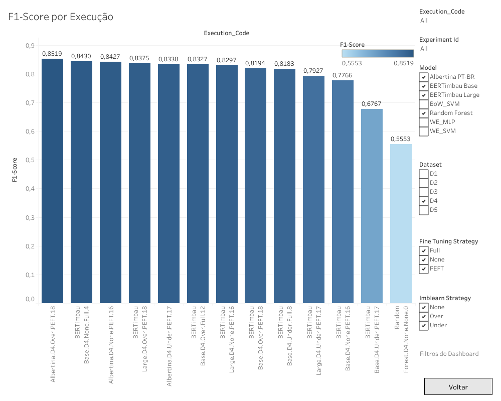

# Projeto do classificador com Deep Learning

- Classificador 1 = Solução Atual c/ Random Forest em R
- Classificador 2 = Solução Proposta c/ BERTimbau Base em Python

### Tamanho das imagens
```console
user@host:~$ docker images
REPOSITORY                                               TAG                IMAGE ID       CREATED         SIZE
classificador1                                           latest             8071c293c5a4   4 years ago     1.43GB
classificador2                                           latest             03a16763b437   2 days ago      2.67GB
```

### Consumo de memória
```console
user@host:~$ docker stats
CONTAINER ID   NAME                      CPU %     MEM USAGE / LIMIT     MEM %     NET I/O          BLOCK I/O       PIDS
c26872c6b0f8   classificador1            0.03%     324.2MiB / 31.09GiB   1.02%     114kB / 4.57kB   145MB / 4.1kB   13
029f3d352160   classificador2            0.00%     1.018GiB / 31.09GiB   3.28%     4.94kB / 0B      0B / 0B         49
```

### Tempo de classificação (100 exemplos)
```console
classificador1
Wall time: 5min 45s

classificador2
Wall time: 13.7 s

classificador2 (w/ cleaner)
Wall time: 18.2 s
```

### F1-Score no dataset D4

```console
classificador1
F1-Score: 0,5553

classificador2
F1-Score: 0,8430
```

### Arquitetura e parâmetros

BERTimbau Base
```console
 Layer (type)                Output Shape              Param #   
=================================================================
 bert (TFBertMainLayer)      multiple                  108923136 
                                                                 
 dropout_37 (Dropout)        multiple                  0         
                                                                 
 classifier (Dense)          multiple                  7690      
                                                                 
=================================================================
Total params: 108930826 (415.54 MB)
Trainable params: 108930826 (415.54 MB)
Non-trainable params: 0 (0.00 Byte)
```

Albertina PT-BR
```console
DebertaV2ForSequenceClassification(
  (deberta): DebertaV2Model(
    (embeddings): DebertaV2Embeddings(
      (word_embeddings): Embedding(128100, 1536, padding_idx=0)
      (LayerNorm): LayerNorm((1536,), eps=1e-07, elementwise_affine=True)
      (dropout): StableDropout()
    )
    (encoder): DebertaV2Encoder(
      (layer): ModuleList(
        (0-23): 24 x DebertaV2Layer(
          (attention): DebertaV2Attention(
            (self): DisentangledSelfAttention(
              (query_proj): Linear4bit(in_features=1536, out_features=1536, bias=True)
              (key_proj): Linear4bit(in_features=1536, out_features=1536, bias=True)
              (value_proj): Linear4bit(in_features=1536, out_features=1536, bias=True)
              (pos_dropout): StableDropout()
              (dropout): StableDropout()
            )
            (output): DebertaV2SelfOutput(
              (dense): Linear4bit(in_features=1536, out_features=1536, bias=True)
              (LayerNorm): LayerNorm((1536,), eps=1e-07, elementwise_affine=True)
              (dropout): StableDropout()
            )
          )
          (intermediate): DebertaV2Intermediate(
            (dense): Linear4bit(in_features=1536, out_features=6144, bias=True)
            (intermediate_act_fn): GELUActivation()
          )
          (output): DebertaV2Output(
            (dense): Linear4bit(in_features=6144, out_features=1536, bias=True)
            (LayerNorm): LayerNorm((1536,), eps=1e-07, elementwise_affine=True)
            (dropout): StableDropout()
          )
        )
      )
      (rel_embeddings): Embedding(512, 1536)
      (LayerNorm): LayerNorm((1536,), eps=1e-07, elementwise_affine=True)
      (conv): ConvLayer(
        (conv): Conv1d(1536, 1536, kernel_size=(3,), stride=(1,), padding=(1,))
        (LayerNorm): LayerNorm((1536,), eps=1e-07, elementwise_affine=True)
        (dropout): StableDropout()
      )
    )
  )
  (pooler): ContextPooler(
    (dense): Linear4bit(in_features=1536, out_features=1536, bias=True)
    (dropout): StableDropout()
  )
  (classifier): Linear(in_features=1536, out_features=10, bias=True)
  (dropout): StableDropout()
)

# full
trainable params: 886969354 || all params: 886969354 || trainable%: 100.0

# load_in_4ibt = True, LoraConfig(r = 8, lora_alpha = 32, lora_dropout = 0.05)
trainable params: 1210388   || all params: 547246100 || trainable%: 0.22117800382679748
```

### Tempo de Treinamento

BERTimbau Base (22,15 min)
```
Epoch 1/4
980/980 [==============================] - 386s 349ms/step - loss: 0.9414 - accuracy: 0.7686 - val_loss: 0.6171 - val_accuracy: 0.8214
Epoch 2/4
980/980 [==============================] - 317s 324ms/step - loss: 0.2652 - accuracy: 0.9352 - val_loss: 0.6031 - val_accuracy: 0.8245
Epoch 3/4
980/980 [==============================] - 313s 319ms/step - loss: 0.1351 - accuracy: 0.9682 - val_loss: 0.6732 - val_accuracy: 0.8137
Epoch 4/4
980/980 [==============================] - 313s 320ms/step - loss: 0.0771 - accuracy: 0.9828 - val_loss: 0.7275 - val_accuracy: 0.8183
```

Albertina PT-BR (4h 47min 37 s)
```
 [7840/7840 4:47:37, Epoch 4/4]
Epoch 	Training Loss 	Validation Loss
1 	0.394800 	0.522636
2 	0.235600 	0.682027
3 	0.119700 	0.725052
4 	0.122500 	0.805629
```

### Ranking ordenado por execuções

 
